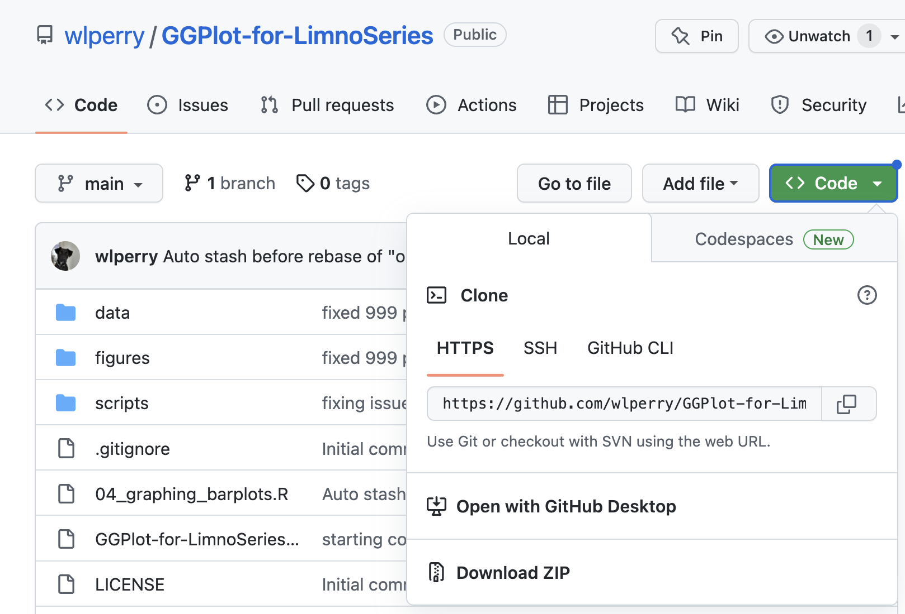

# GGPlot-for-LimnoSeries

The goal of this workshop is to introduce you to a few packages and approaches that can make data exploration with graphs and graphical presentation of data in lectures and publications easier. We will do this as a live coding exercise using skeleton scripts that will help organize the process but feel free to ask questions that take us off on tangents as this is where we all can learn even more. So I encourage you to stop me at any time and we will have helpers that will be able to take you to a break out room if things are really broken.

The data we will use is from Toolik Lake in the 1990's that is freely available at the links in the citations below.

The packages we will use (install and library commands at bottom of sheet) - I use a core set of packages that seem to make life a lot easier in my data flows. These are installed one time and run at the start of every script:

-   tidyverse - all of the ggplot, dplyr, lubridate and other Whickham tools
-   scales - allows better manipulation of the x and y scales
-   readxl - read in excel files
-   janitor - does a lot but most importantly cleans the names of the variables
-   patchwork - allows placing multiple graphs on one page and annotating
-   plotly - the part I use is ggplotly that animates graphs
-   skimr - simple summary states in a tidy way

These packages are installed one time and run only once as they load a menu item in Addins in the tool bar in RStudio: These packages are:

-   ggThemeAssist - allows you to manipulate the themes of graphs in ggplot
-   styler - allows you to quickly reformat the code so its readable

# To Start -

In github you can download a zip file of the project as shown below in the screen shot.

{width="461"}

After it is downloaded you can open the **GGPlot-for-LimnoSeries.Rproj** file. Since this is a project it does not matter where this folder is as everything should run no matte where the folder is or what computer you are on.

# 1) Examples of Themes, Multipanel Graphs and Plotly

Most of the code for themes, multipanel graphs, and plotly will be done with one file - **01_intro_graphing zoops_for_workshop.R**. Preparing the data for this file was done with 00_prep_of_original_data.R but we will not go into that but it is there if you are interested. In this file we will...

-   import a file and fix the headers (janitor)
-   make a simple graph
-   set the themes settings
    -   using ggThemeAssist
    -   save a theme for use later on - 2 ways
-   Make quick multipanel graphs with facet_wrap and facet_grid
-   Use ggplotly from the plotly package to check on specific data points and animate the graph
-   Customize graphs by setting the colors, fills, line types, symbol shapes using set_XXX_manual
-   Make custom mutipanel graphs for publication
-   **Given time** - reordering the series of data to what you want

# 2) Depth Profile data

So one of the main issues with GGplot is trying to produce graphs with data like dissolved oxygen or temperature on the X-axis on top and depth going down the Y-axis. We will use **02_Graphing_with_depth_for_workshop.R** to practice this. GGplot does not like to play nice with that sort of ploting of data. We will cover how to do these sort of plots in two ways:

-   First using coord_flip of the graph - sort of a pain

-   Making the graph with geom_path command and not geom_line

-   Making graphs of summarized data with mean and standard error

# 3) Bar plots?

How do you do stacked or non stacked bar plots

# 4) Tables and live documents

Yes - rMarkdown is a way to do tables and live documents - a shrot intro to Kabble and KabbleExtra here but they only export to HTML and PDF documents right now.

# 5) Heat maps

Working on porting this over but this was done at GLEON in New York a few years back and the University of Miami - Oxford graduate students did this and I modified it a bit here or on my website. Working on this but am sure there will not be time but might be of interst.

### Citation for data

Giblin, A. and G. Kling. 2019. Chlorophyll a and primary productivity data for various lakes near Toolik Research Station, Arctic LTER. Summer 1990 to 1999. ver 4. Environmental Data Initiative. <https://doi.org/10.6073/pasta/1b1538449340e68760cf86d92d7082de> (Accessed 2023-03-13).

Giblin, A. and G. Kling. 2016. Physical and chemical data for various lakes near Toolik Research Station, Arctic LTER. Summer 1990 to 1999 ver 4. Environmental Data Initiative. <https://doi.org/10.6073/pasta/1fd85582de93a281e5e5d3b80df97b52> (Accessed 2023-03-13).

Budy, P., C. Luecke, and J. O'Brien. 2016. Zooplankton density for lake samples collected near Toolik Lake Arctic LTER in the summer from 1983 to 1992. ver 4. Environmental Data Initiative. <https://doi.org/10.6073/pasta/e711d62032f0b78b9a91070a38f2b43f> (Accessed 2023-03-13).
